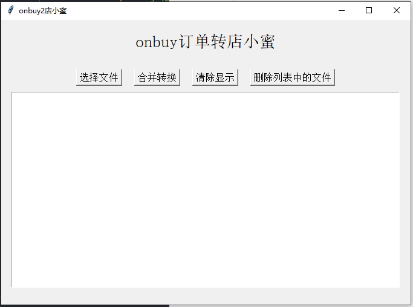

## Onbuy_2_dianxiaomi 
- onbuy订单表转化到店小秘格式，用于生成打印单，节省表整理时间
- onbuy导出excel表，支持多表操作，需要同样格式，放置`.exe`同文件目录
- `onbuy导出订单.csv`文件名将填充至`属性(可填写SKU尺寸、颜色等)`字段可自己改名字，区分店铺
- 暂时只支持`.csv`文件格式，转化后保留源文件，生成第一个读取的文件
- 添加了`tkinter`简易UI，可直接选择文件操作
- python环境下`pyinstaller -F -w do.py `打包，dist目录生成执行exe文件

- 界面  
